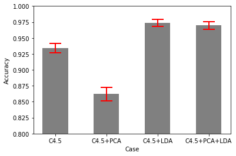
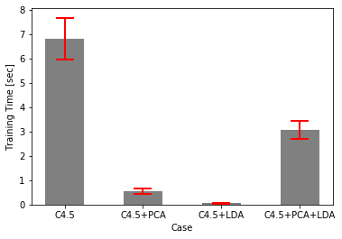
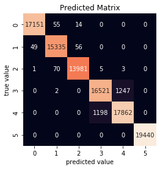

# Feature_reduction_Decision_tree

## Abstract  
In this study, three methods of feature reduction were analyzed to investigate the effect on accuracy and
computational cost of a C4.5 classifying decision tree algorithm on the Human Activity Recognition (HAR)
Using Smartphones dataset from the UCI Machine Learning Repository. The dataset is comprised of 561
attributes measured from the accelerometer and gyroscope of a smartphone over 10299 instances. Feature
reduction on the dataset helps to solve the overfitting behaviour of the C4.5 algorithm when fitting data
with many extraneous features. The dimension reduction techniques analysed were principal component
analysis (PCA), linear discriminant analysis (LDA), and a PCA+LDA combination. The feature reduction
methods were applied to the training set to transform the data. Using the reduced dataset, a C4.5 decision
tree was trained and then used to predict the class labels using the transformed testing dataset. From the
analysis of this study, LDA outperforms the other dimension reduction methods in accuracy, precision and
computational complexity resulting in a final testing accuracy on the HAR dataset of 95.62%.

## Results

The four cases of varying feature extraction methods (None, PCA, LDA, PCA+LDA) were used to train a C4.5 classifying decision tree. The trained model was used to classify the testing set and the accuracy was reported based on 10-times 10-fold cross-validation. The computational cost of the techniques was evaluated by reporting the processing time to train the model. The training time was chosen to be reported since it was determined to be the most substantial time. All the techniques were implemented using Python 3.7.3 on a system with Intel Core i5-8250U CPU @1.60GHz and 8.00GB of RAM. The results of the accuracy and training time with the corresponding standard deviation (STD) values for the varying techniques are summarized in Table I.

TABLE I: 10-TIME-10-FOLD CROSS VALIDATION ACCURACY & TRAINING TIME RESULTS
|              | Accuracy |   STD  | Train Time |   STD   |
|:------------:|:--------:|:------:|:----------:|:-------:|
|              |    [%]   |   [%]  |    [sec]   |  [sec]  |
|     C4.5     |   93.53  | 0.8659 |    6.814   |  0.8612 |
|   C4.5+PCA   |   86.12  |  1.106 |   0.5544   |  0.1091 |
|   C4.5+LDA   |   97.37  | 0.5224 |   0.05903  | 0.01709 |
| C4.5+LDA+PCA |   96.97  | 0.6055 |    3.062   |  0.3752 |

The varying results of accuracy and training time are visualized using bar graphs as shown in Figure 1 and Figure 2.   
*Figure 1. Bar graph of the results of feature extraction techniques on accuracy.*  
*Figure 2. Bar graph of the results of feature extraction techniques on training time.*  

From the results of the cross-validation, using LDA in the preprocessing step of the C4.5 classifying tree was determined to be the best setup studied in this analysis. The C4.5 decision tree accuracy for classifying was improved by 4.1% while decreasing the computational complexity to train the model by 99% for the HAR dataset. The precision of the model is improved using LDA by 40% as shown by the lower standard deviation in the accuracy results. 

Using LDA for feature reduction alongside the C4.5 algorithm, the final accuracy of the training and testing data from the UCI Machine Learning Repository was determined. The training and testing data from the repository are approximately a 70/30 split, respectively. The test accuracy of the best model setup determined by this study was 95.62% with the confusion matrix shown in  Figure 3.

*Figure 3. Confusion matrix for the test accuracy of 95.62%.*

